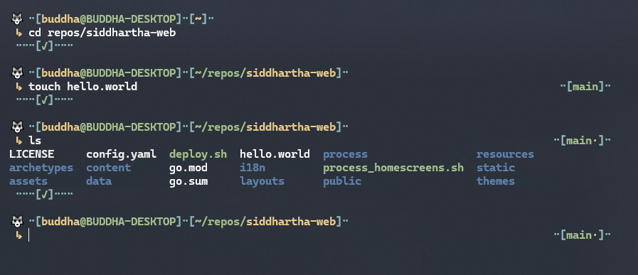

# Buddha - A ZSH Theme

## Features
* Working directory highlights for readability.
* Blocky structure for "contained" commands.
* Won't check success of last command on a new or cleared zsh.
* Best enjoyed using [Nord](https://www.nordtheme.com/) colors!

# Installation
## Prerequisites
Install [OhMyZSH](https://github.com/ohmyzsh/ohmyzsh).

## Oneliner
### curl
`sh -c "$(curl -fsSL https://raw.githubusercontent.com/BuddhaDom/zsh-buddha/master/deploy.zsh)"`
### wget
`sh -c "$(wget -O- https://raw.githubusercontent.com/BuddhaDom/zsh-buddha/master/deploy.zsh)"`
### fetch
`sh -c "$(fetch -o - https://raw.githubusercontent.com/BuddhaDom/zsh-buddha/master/deploy.zsh)"`

## Manual
1. Download the theme. \
`git clone --quiet https://github.com/BuddhaDom/zsh-buddha ~/.oh-my-zsh/custom/themes/buddha`
2. Select this theme. \
`omz theme set buddha/buddha`
3. Done! Reload your shell.\
`omz reload`
4. 🐺